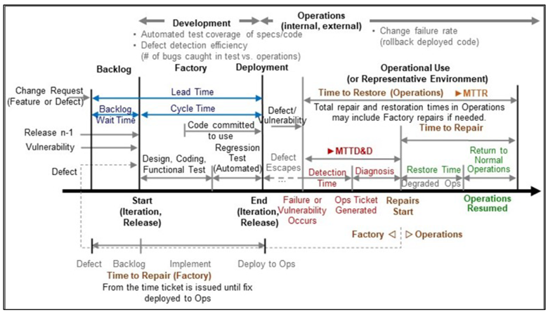

In the world of software development, the quality and efficiency of processes are fundamental to the success of any project. An essential principle that many teams still underestimate is the concept of "Measure to Improve." In other words, to enhance our processes and outcomes, we first need to understand and quantify what is happening.

Measuring the performance of our software and development practices is not just about tracking metrics but rather about gaining valuable insights that guide our decisions. By monitoring key indicators such as response time, error rates, resource efficiency, and user feedback, we can identify problematic areas and opportunities for improvement.

For example, the continuous analysis of metrics such as the average time to resolve bugs or the frequency of test failures can reveal patterns that indicate the need for adjustments in the development approach or testing strategy. Similarly, monitoring the delivery time of features and customer satisfaction can inform adjustments in project management practices and requirement definition.

The cycle of measuring, analyzing, and adjusting is vital for promoting continuous improvement. When we implement changes based on concrete data and evidence, we not only optimize our work but also ensure that we are aligned with user needs and market expectations.

Therefore, by incorporating systematic measurement into our development routine, we are not only striving for better performance but also fostering a mindset of continuous improvement. Remember: in a world where innovation and efficiency are key to success, measuring is the first step towards improving.  The figure below presents some metrics and shows where they are executed.

