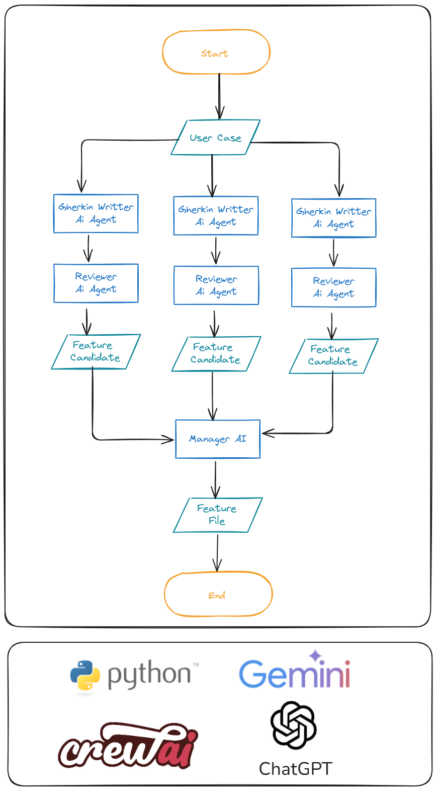

**Test.Ai** is a tool that leverages intelligent agents and artificial intelligence to optimize the development of test cases, automating tests based on information extracted from analysis documents, project documentation, and existing code.

## Features

1. Create Feature files using Description of User Case;
2. Create E2E Automatic test;
3. Create Back-End Automatic test;
4. Create Front-end Automatic test;

## Create Feature files using Description of User Case

The create of E2E tests is an API built with FastAPI that accepts the User Case description and sends them to the Google Gemini API for creation of the Feature file. 

The API provides endpoints to submit the description of user case and access the Swagger documentation.

### How it works

The CrewAI workflow works as follows: 



### Usage

1.  Submitting a User Case Description

The API is available at http://testai.leds.dev.br:3000. It's possible to use curl to submit description of user case and receive the feature.

Example Request:

```bash
curl -X POST http://testai.leds.dev.br:3000/gherkin \
    -H "Content-Type: application/json" \
    -d '{
        "evento": "UC02.4: Excluir Resolução: O Servidor Fapes seleciona a resolução (sem modalidades associadas) que deseja excluir. O Servidor Fapes confirma a exclusão da resolução. O Sistema exclui a resolução."
        }'
```

2. Response Format

The API will return a JSON response containing the Feature file:
```bash
{
    "feature": "Feature: Excluir Resolução\n\n Scenario Outline: Nome Scenario\n    Given exemplo de given\n    When exemplo de when\n    Then exemplo de then\n\n    Examples:\n      | exemplos |\n    | exemplo1 |"
}
```

3. Accessing API Documentation

FastAPI automatically generates interactive API documentation. You can access this by going to:

    Swagger UI: http://testai.leds.dev.br:3000/docs